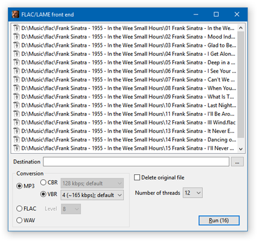

# FLAC and LAME front end

A native Windows GUI to work with both [FLAC](https://en.wikipedia.org/wiki/FLAC) and [LAME](https://en.wikipedia.org/wiki/LAME) command line tools, allowing conversions among MP3, FLAC and WAV audio formats.

## Setup

First, download the command line tools themselves:

* [FLAC](https://ftp.osuosl.org/pub/xiph/releases/flac/)
* [LAME](https://www.rarewares.org/mp3-lame-bundle.php)

Then write the paths in `flac-lame-frontend.ini` file, which is in the same folder of the executable. The `flac-lame-frontend.exe` doesn't need any kind of installation – just run.

## How it works

Drop the audio files into the application window and choose your conversion settings. Once you hit **Run**, several processes will be launched – one for each audio file –, and the conversions will be performed in parallel.

## License

This application was originally written in C++. This version is now archived in [cpp-v1](https://github.com/rodrigocfd/flac-lame-frontend/tree/cpp-v1) branch.

Licensed under [MIT License](https://opensource.org/licenses/MIT), see [LICENSE.md](LICENSE.md) for details.
