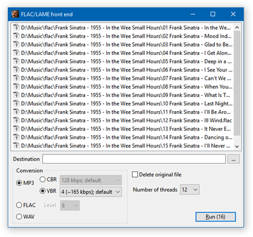

# FLAC and LAME front end

A simple GUI to work with [FLAC](https://en.wikipedia.org/wiki/FLAC) and [LAME](https://en.wikipedia.org/wiki/LAME) command line tools, allowing conversions from/to MP3, FLAC and WAV audio formats.

* Download [FLAC](https://ftp.osuosl.org/pub/xiph/releases/flac/)
* Download [LAME](http://www.rarewares.org/mp3-lame-bundle.php)

Once dowloaded, write the FLAC and LAME paths in `flac-lame-frontend.ini` file.

## Dependencies

This project is written in C++20 and uses [WinDlg](https://github.com/rodrigocfd/windlg) library, whose code is vendored in `windlg` directory.

## License

Licensed under [MIT license](https://opensource.org/licenses/MIT), see [LICENSE.md](LICENSE.md) for details.
