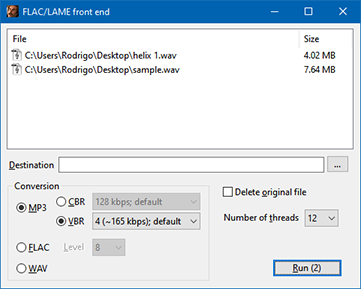

# FLAC and LAME front end

An easy GUI to work with [FLAC](https://ftp.osuosl.org/pub/xiph/releases/flac/) and [LAME](http://www.rarewares.org/mp3-lame-bundle.php) command line tools, allowing conversions from/to MP3, FLAC and WAV audio formats.



## WinLamb library

This project uses [WinLamb](https://github.com/rodrigocfd/winlamb) library in a [subtree](http://bluedesk.blogspot.com.br/2017/06/trying-out-git-subtree.html). To add the subtree, run:

```
git remote add winlamb --no-tags https://github.com/rodrigocfd/winlamb.git
git subtree add --prefix winlamb winlamb master --squash
```

If you want to update the library, pull the code from the repo:

```
git subtree pull --prefix winlamb winlamb master --squash
```

### Showcase

The project showcases the following WinLamb features:

* main and modal dialogs;
* parallel multi-threaded background operations;
* listview control;
* combobox control;
* progress indicator on taskbar;
* read from INI files;
* execute external command-line programs.
